# Claude Code Best Practices Template

[English](#english) | [中文](#中文)

---

## English

A comprehensive Claude Code configuration template for development teams. Supports **Python / Vue / TypeScript / C++ / Java / C# / Go** with built-in workflows, hooks, and multi-language coding standards.

### ✨ Features

- **🎭 Role-based Workflow** - PM → Lead → Dev → QA → Commit cycle
- **🔄 Autonomous Iteration** - `/iterate` mode for self-driving development
- **🛡️ Safety Hooks** - Pre-configured guards against dangerous operations
- **📐 Multi-language Rules** - Coding standards for 7+ languages
- **🧠 Memory Bank** - Progress tracking and architecture documentation
- **🔌 MCP Integration** - Ready-to-use MCP server configurations

### Quick Start

```bash
# 1. Clone this template
git clone https://github.com/xiaobei930/claude-code-best-practices.git

# 2. Copy to your project
cp -r claude-code-best-practices/.claude /path/to/your/project/
cp claude-code-best-practices/CLAUDE.md /path/to/your/project/

# 3. Initialize
cd /path/to/your/project
bash .claude/scripts/init.sh

# 4. Customize CLAUDE.md (replace placeholders)
# {{PROJECT_NAME}}, {{DATE}}, {{PROJECT_DESCRIPTION}}

# 5. Start developing
/pm   # Begin first requirement
```

### Workflow Commands

| Command | Role | Description |
|---------|------|-------------|
| `/pm` | Product Manager | Requirement analysis |
| `/lead` | Tech Lead | Technical design & task breakdown |
| `/dev` | Developer | Implementation |
| `/qa` | QA Engineer | Testing & verification |
| `/commit` | - | Git commit |
| `/iterate` | - | Autonomous iteration loop |
| `/pair` | - | Pair programming mode |

### Project Structure

```
your-project/
├── CLAUDE.md                 # Project constitution
├── memory-bank/              # Progress & architecture docs
└── .claude/
    ├── commands/             # Slash commands (30+)
    ├── rules/                # Coding standards (13 files)
    ├── skills/               # Development skills (10 categories)
    ├── agents/               # Sub-agents (6 types)
    ├── hooks/                # Hook documentation
    └── scripts/              # Automation scripts
```

### Supported Languages

| Language | Style Guide | Formatter | Test Framework |
|----------|-------------|-----------|----------------|
| Python | `code-style.md` | Black + isort | pytest |
| Vue/TS/JS | `frontend-style.md` | Prettier | Vitest |
| C++ | `cpp-style.md` | clang-format | Google Test |
| Java | `java-style.md` | google-java-format | JUnit |
| C# | `csharp-style.md` | dotnet format | xUnit/NUnit |
| Go | `backend-patterns/go.md` | gofmt | testing |

### Philosophy

This template follows the **"道法术器" (Dao-Fa-Shu-Qi)** methodology:
- **道 (Dao)** - Core principles and philosophy
- **法 (Fa)** - Methods and workflows
- **术 (Shu)** - Practices and techniques
- **器 (Qi)** - Tools and configurations

### Note

This template is primarily designed for **Chinese-speaking developers**. Most internal documentation (rules, commands, skills) is written in Chinese. International users are welcome to use and adapt it, or contribute English translations.

### License

MIT License - Feel free to use and modify.

---

## 中文

这是一个可复制到任意项目的 Claude Code 配置模板，支持 **Python / Vue / TypeScript / C++ / Java / C# / Go** 多语言开发。

### ✨ 特性

- **🎭 角色化工作流** - PM → Lead → Dev → QA → Commit 循环
- **🔄 自主迭代模式** - `/iterate` 模式实现自驱动开发
- **🛡️ 安全钩子** - 预配置的危险操作防护
- **📐 多语言规则** - 7+ 种语言的编码规范
- **🧠 记忆库** - 进度跟踪和架构文档
- **🔌 MCP 集成** - 开箱即用的 MCP 服务器配置

### 快速使用

#### 1. 复制配置到你的项目

```bash
# 复制整个模板内容到目标项目
cp -r claude-code-best-practices/* /path/to/your/project/

# 或者使用 robocopy (Windows)
robocopy claude-code-best-practices /path/to/your/project /E
```

#### 2. 运行初始化（二选一）

**方式 A：使用初始化脚本（推荐）**
```bash
cd /path/to/your/project
bash .claude/scripts/init.sh
```

**方式 B：使用 /setup 命令**
```
/setup
```

初始化脚本会自动：
- 创建 `settings.local.json`（从 `.example` 复制）
- 创建 `memory-bank/` 目录和基础文件
- 创建 `docs/` 目录结构

#### 3. 自定义 CLAUDE.md

编辑 `CLAUDE.md`，替换以下占位符：
- `{{PROJECT_NAME}}` - 项目名称
- `{{PROJECT_DESCRIPTION}}` - 项目描述
- `{{DATE}}` - 当前日期
- `{{CURRENT_PHASE}}` - 当前阶段

#### 4. 验证配置（可选）

```bash
python .claude/scripts/test_template.py
```

#### 5. 开始开发

```bash
/pm   # 开始第一个需求
```

### 目录结构

```
your-project/
├── CLAUDE.md                   # 项目主文档（必须）
├── CLAUDE.local.md             # 个人本地配置（可选，不提交）
│
├── memory-bank/                # 项目记忆库
│   ├── progress.md             # 进度跟踪
│   ├── architecture.md         # 架构文档
│   └── tech-stack.md           # 技术选型
│
└── .claude/
    ├── settings.json           # 基础权限（提交到 Git）
    ├── settings.local.json     # 本地权限 + Hooks（不提交）
    ├── hookify.*.local.md      # Hookify 行为规则（不提交）
    │
    ├── commands/               # Slash 命令
    │   ├── pm.md               # 产品经理角色
    │   ├── lead.md             # 技术负责人角色
    │   ├── dev.md              # 开发者角色
    │   ├── qa.md               # 测试角色
    │   ├── iterate.md          # 自主迭代循环
    │   ├── pair.md             # 结对编程模式
    │   └── ...
    │
    ├── ralph-prompts/          # 长循环提示词模板（/ralph-loop）
    │   ├── iterate-phase.md    # Phase 迭代
    │   ├── fix-tests.md        # 测试修复
    │   ├── refactor.md         # 代码重构
    │   ├── full-feature.md     # 完整功能开发
    │   ├── bug-fix.md          # Bug 修复流程
    │   └── doc-gen.md          # 文档生成
    │
    ├── rules/                  # 代码规则（按文件类型自动应用）
    │   ├── methodology.md      # 通用开发方法论
    │   ├── performance.md      # 性能优化和模型选择策略
    │   ├── code-style.md       # Python 风格
    │   ├── frontend-style.md   # Vue/TS/JS 风格
    │   ├── ui-design.md        # UI 设计规范
    │   ├── cpp-style.md        # C++ 风格
    │   ├── esp32-c-style.md    # ESP32 嵌入式 C 风格
    │   ├── java-style.md       # Java 风格
    │   ├── csharp-style.md     # C# 风格
    │   ├── testing.md          # 测试规范
    │   ├── security.md         # 安全规则
    │   └── git-workflow.md     # Git 工作流规则
    │
    ├── contexts/               # 动态上下文注入（模式切换）
    │   ├── dev.md              # 开发模式上下文
    │   ├── review.md           # 代码审查模式上下文
    │   ├── research.md         # 研究探索模式上下文
    │   ├── pm.md               # 产品经理角色上下文
    │   ├── lead.md             # 技术负责人角色上下文
    │   └── qa.md               # 测试工程师角色上下文
    │
    ├── agents/                 # 子智能体
    │   ├── code-reviewer.md    # 代码审查
    │   ├── code-simplifier.md  # 代码简化
    │   ├── planner.md          # 任务规划
    │   ├── requirement-validator.md  # 需求验证
    │   ├── security-reviewer.md      # 安全审查
    │   └── tdd-guide.md        # TDD 指导
    │
    ├── skills/                 # 自定义技能
    │   ├── backend-patterns/   # 后端开发模式（含多语言子文件）
    │   │   ├── SKILL.md        # 通用后端模式
    │   │   ├── python.md       # Python/FastAPI/Django
    │   │   ├── typescript.md   # TypeScript/Node.js
    │   │   ├── java.md         # Java/Spring Boot
    │   │   ├── go.md           # Go/Gin/Echo
    │   │   └── csharp.md       # C#/ASP.NET Core
    │   ├── frontend-patterns/  # 前端开发模式（含多框架子文件）
    │   │   ├── SKILL.md        # 通用前端模式
    │   │   ├── vue.md          # Vue 3/Nuxt
    │   │   └── react.md        # React 18/Next.js
    │   ├── tdd-workflow/       # TDD 测试驱动开发
    │   ├── security-review/    # 安全审查清单
    │   ├── api-development/    # RESTful API 开发
    │   ├── database-patterns/  # 数据库设计模式
    │   ├── debugging/          # 系统化调试技巧
    │   ├── git-workflow/       # Git 工作流最佳实践
    │   ├── continuous-learning/ # 持续学习（会话评估）
    │   └── strategic-compact/  # 策略性上下文压缩
    │
    ├── docs/                   # 内部文档
    │   └── plugin-integration.md  # 插件集成指南
    │
    ├── mcp-configs/            # MCP 服务器配置参考
    │   ├── mcp-servers.json    # 完整配置（复制到 ~/.claude.json）
    │   └── README.md           # 使用说明
    │
    └── scripts/                # Hook 脚本和工具
        ├── init.sh             # 项目初始化脚本
        ├── ralph.sh            # Ralph Loop 启动脚本
        ├── test_template.py    # 模板验证脚本
        ├── format_file.py      # 代码格式化
        ├── validate_command.py # 命令验证
        ├── protect_files.py    # 敏感文件保护
        ├── session_check.py    # 会话启动检查
        ├── session_start.sh    # 会话启动上下文加载
        ├── session_end.sh      # 会话结束状态持久化
        ├── pre_compact.sh      # 上下文压缩前保存
        ├── check_console_log.py # console.log 检查
        ├── notify_complete.py  # 任务完成通知
        ├── pause_before_push.sh # Git push 前暂停确认
        ├── block_random_md.py  # 阻止随机创建 .md 文件
        └── typescript_check.sh # TypeScript 类型检查
```

### 支持的语言

| 语言 | 规则文件 | 格式化工具 | 测试框架 |
|------|----------|------------|----------|
| Python | `code-style.md` | Black + isort | pytest |
| Vue/TS/JS | `frontend-style.md` | Prettier | Vitest |
| C++ | `cpp-style.md` | clang-format | Google Test |
| Java | `java-style.md` | google-java-format | JUnit |
| C# | `csharp-style.md` | dotnet format | xUnit/NUnit |
| Go | `backend-patterns/go.md` | gofmt | testing |

### 工作流程

```mermaid
flowchart LR
    PM["/pm<br/>需求分析"] --> Clarify["/clarify<br/>澄清（如需）"]
    Clarify --> Lead["/lead<br/>技术方案"]
    Lead --> Designer["/designer<br/>UI 设计"]
    Designer --> Dev["/dev<br/>编码实现"]
    Dev --> QA["/qa<br/>功能验证"]
    QA --> Commit["/commit<br/>代码提交"]
    Commit --> Clear["/clear<br/>清除上下文"]
    Clear -.->|循环| PM
```



**开发模式**:
- `/iterate` - 自主迭代循环（单 session，完全自主）
- `/pair` - 结对编程模式（人机协作，每步确认）
- `/ralph-loop` - 长时间循环（需安装插件，见 `.claude/ralph-prompts/`）

#### 模式选择指南

| 场景 | 推荐模式 |
|------|----------|
| 任务清单明确，单 session 内执行 | `/iterate` |
| 学习新技术、设计讨论、敏感操作 | `/pair` |
| 长时间批量任务（小时级） | `/ralph-loop` |

### 技能（Skills）说明

模板包含多个开发技能，可按需启用：

| 技能 | 用途 | 主要内容 |
|------|------|----------|
| `backend-patterns` | 后端开发 | 通用模式 + 多语言子文件（Python/TS/Java/Go/C#） |
| `frontend-patterns` | 前端开发 | 通用模式 + 多框架子文件（Vue/React） |
| `tdd-workflow` | 测试驱动开发 | Red-Green-Refactor 循环 |
| `security-review` | 安全审查 | OWASP 检查清单、漏洞防护 |
| `api-development` | API 开发 | RESTful 设计、响应格式、认证 |
| `database-patterns` | 数据库设计 | 命名规范、查询优化、迁移管理 |
| `debugging` | 系统化调试 | 问题定位、日志分析、性能剖析 |
| `git-workflow` | Git 工作流 | 分支策略、提交规范、冲突解决 |
| `continuous-learning` | 持续学习 | 会话评估、知识提取、模式记录 |
| `strategic-compact` | 策略性压缩 | 压缩时机、压缩清单、最佳实践 |

#### 技能结构说明

`backend-patterns` 和 `frontend-patterns` 采用 **主文件 + 语言/框架子文件** 的结构：

- **SKILL.md**: 通用模式和清单（自动加载）
- **语言子文件**: 按项目技术栈按需加载（如 `python.md`、`vue.md`）

这种结构的好处：
1. 减少重复内容
2. 按需加载，减少 token 消耗
3. 方便扩展新语言/框架

### 自定义

#### 添加新规则

1. 在 `.claude/rules/` 创建 `your-rule.md`
2. 使用 YAML frontmatter 指定匹配路径：

```yaml
---
paths:
  - "**/*.your-ext"
---

# 规则内容
```

#### 添加新命令

1. 在 `.claude/commands/` 创建 `your-command.md`
2. 定义命令行为和输出格式
3. 使用 `/your-command` 调用

#### 配置 Hooks

编辑 `.claude/settings.local.json`，模板预配置的 Hooks 包括：

| Hook 类型 | 触发器 | 功能 | 脚本 |
|-----------|--------|------|------|
| PreToolUse | `Bash` | 验证危险命令 | `validate_command.py` |
| PreToolUse | `Bash` | Git push 前确认 | `pause_before_push.sh` |
| PreToolUse | `Write\|Edit` | 保护敏感文件 | `protect_files.py` |
| PreToolUse | `Write` | 阻止随机 .md 文件 | `block_random_md.py` |
| PreToolUse | `Edit\|Write` | 策略性压缩建议 | `suggest-compact.sh` |
| PostToolUse | `Write\|Edit` | 自动格式化代码 | `format_file.py` |
| PostToolUse | `Edit` | 检查 console.log | `check_console_log.py` |
| PostToolUse | `Edit\|Write` | TypeScript 类型检查 | `typescript_check.sh` |
| SessionStart | `*` | 会话健康检查 | `session_check.py` |
| SessionStart | `*` | 加载上次会话上下文 | `session_start.sh` |
| PreCompact | `*` | 压缩前保存状态 | `pre_compact.sh` |
| Stop | `*` | 会话结束持久化 | `session_end.sh` |
| Stop | `*` | 持续学习评估 | `evaluate-session.sh` |

### 最佳实践

1. **CLAUDE.md 保持简洁** - 控制在 100 行以内
2. **使用规则文件** - 详细规范放在 `.claude/rules/`
3. **更新 progress.md** - 每次任务完成后更新
4. **上下文管理**:
   - 普通模式：频繁 `/clear`，避免上下文过长
   - `/iterate` 模式：不主动 clear，保持循环连续性
5. **MCP 不要贪多** - 同时启用不超过 10 个

### 参考

**官方资源**:
- [Anthropic 官方最佳实践](https://www.anthropic.com/engineering/claude-code-best-practices)
- [CLAUDE.md 完整指南](https://www.builder.io/blog/claude-md-guide)

**社区项目**:
- [everything-claude-code](https://github.com/affaan-m/everything-claude-code) - Comprehensive Claude Code resources
- [vibe-coding-cn](https://github.com/2025Emma/vibe-coding-cn) - 中文 Vibe Coding 指南

### 许可证

MIT License - 可自由使用和修改

---

## Contributing

Contributions are welcome! Please feel free to submit a Pull Request.

欢迎贡献！请随时提交 Pull Request。
